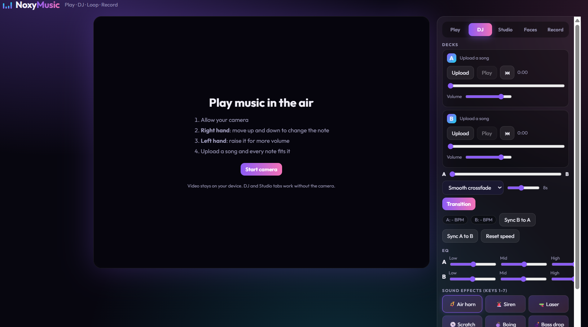
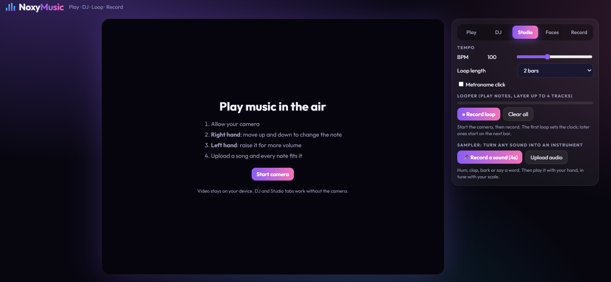
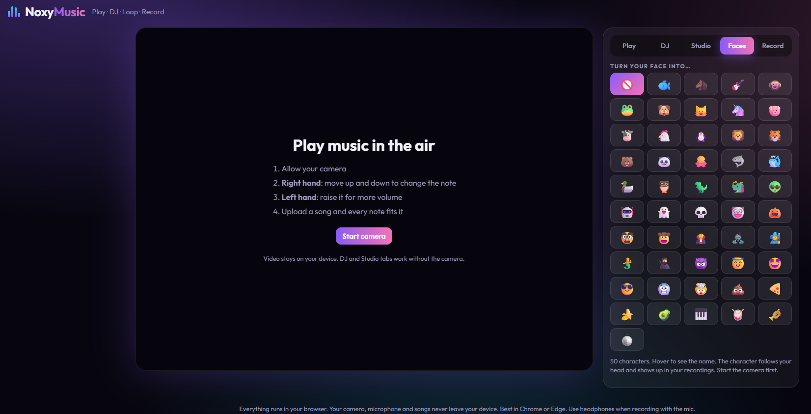
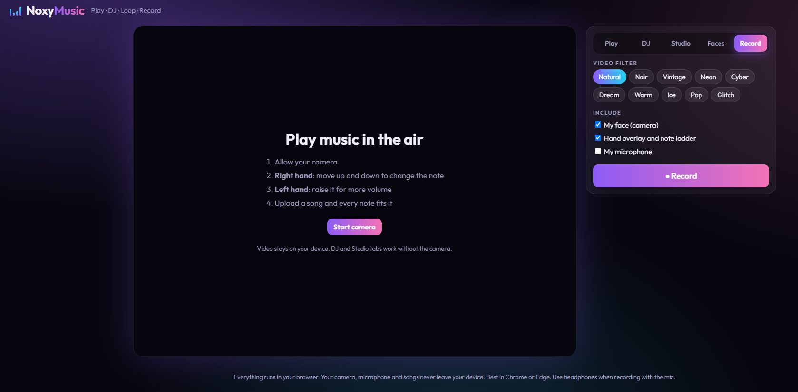

# NoxyMusic

Make music with your hands. Play instruments with hand gestures, DJ with two decks, layer loops, turn any sound into an instrument, add face characters and record it all. Runs fully in the browser.

**Live demo: https://neminorniel24-droid.github.io/noxymusic/**

<p align="center">
  
  
  
  
</p>

**Live demo: https://neminorniel24-droid.github.io/noxymusic/**

<p align="center">
  
  
  
  
</p>

## Features
- Hand-tracked synth: right hand picks the note, left hand sets the volume, notes snap to a scale
- Song upload with automatic key detection
- DJ mode: two decks, five transitions, sound effects
- Studio: looper with up to 4 layers, metronome, sampler
- 50 face characters and 10 video filters, recorded into the video
- Audio and video recording with download
- DJ lights: beat-reactive light show, with a lights-only full-screen mode
- BPM detection with deck sync, three-band EQ per deck
- Themes, keyboard shortcuts, help dialog, offline support

## Run locally
```bash
python3 -m http.server 8000
```
Open http://localhost:8000 (camera and microphone need localhost or HTTPS).

## Deploy
See [docs/DEPLOY.md](docs/DEPLOY.md). GitHub Pages deploys automatically from `main`.

## Project structure
```
index.html          page markup
css/                base, stage, panel, components styles
js/                 core, audio, notes, hands, looper, dj, sampler, faces, record
assets/             icons
docs/               architecture, gestures, deploy, roadmap, FAQ, troubleshooting, accessibility
sw.js               offline service worker
scripts/            local checks (npm run check)
.github/            Pages workflow, issue and PR templates
```

## Keyboard shortcuts
1-7 effects, Space play or pause, [ ] crossfader, T transition, R record, M metronome, ? help.

## Browser support
Chrome and Edge on desktop work best. Canvas video filters are not supported in Safari.

## Privacy
Camera, microphone and uploaded songs stay on the device. Nothing is uploaded to a server.

## Documentation
See the docs folder: ARCHITECTURE, GESTURES, SHORTCUTS, DEPLOY, FAQ, TROUBLESHOOTING, PRIVACY, ACCESSIBILITY, BROWSER_SUPPORT and ROADMAP.

## Contributing
See [CONTRIBUTING.md](CONTRIBUTING.md).

## License
MIT, see [LICENSE](LICENSE).
